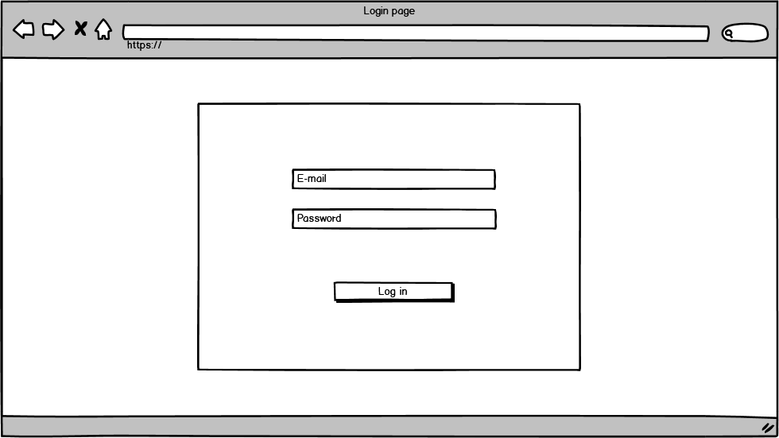
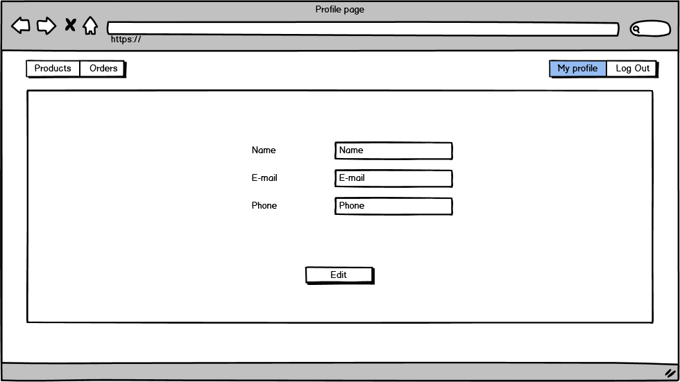
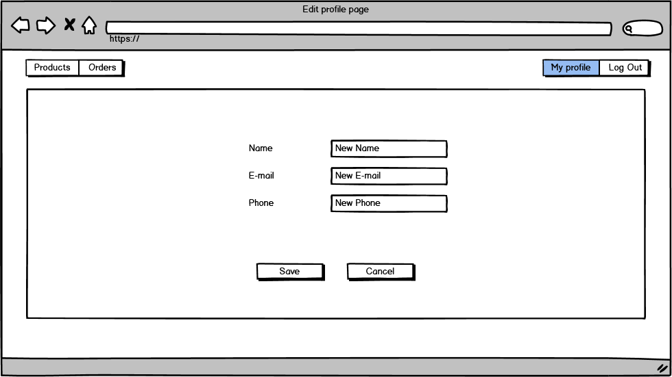
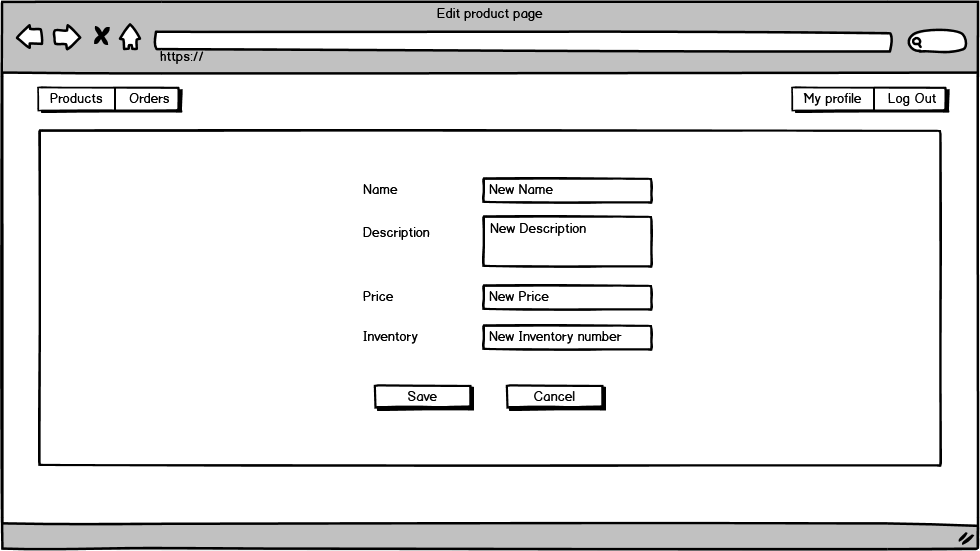
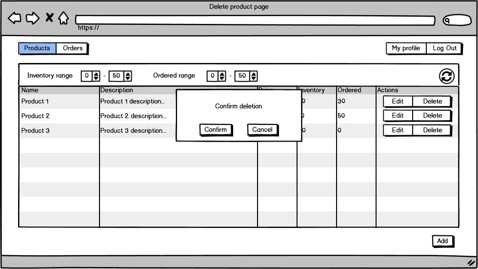
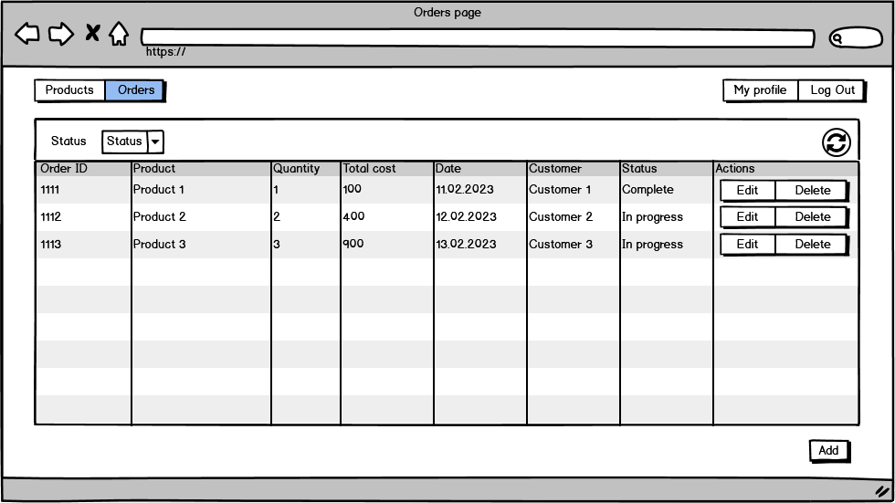
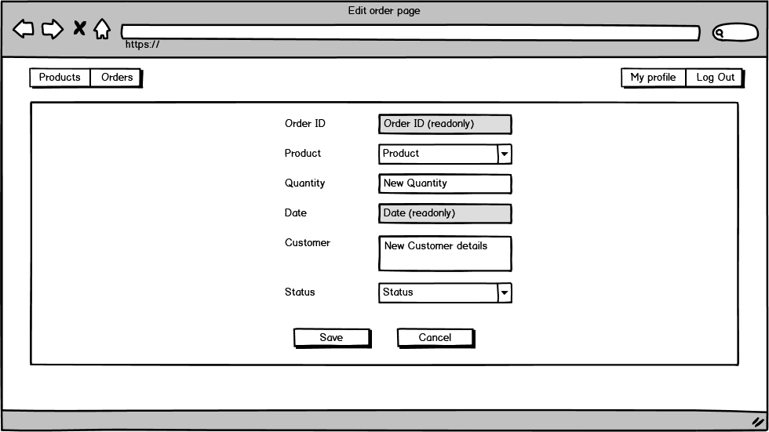
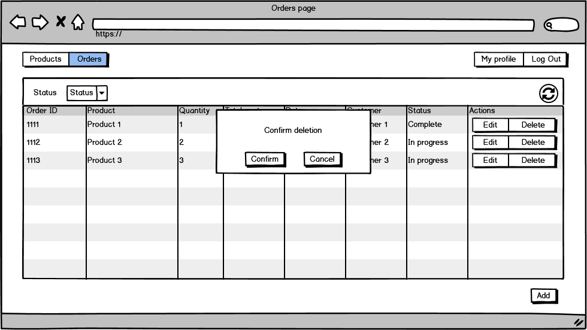
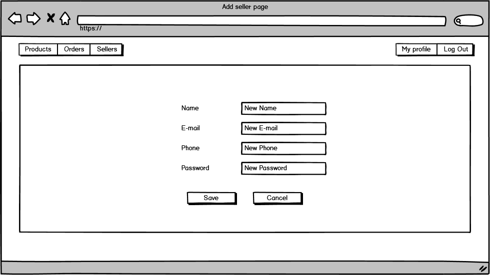
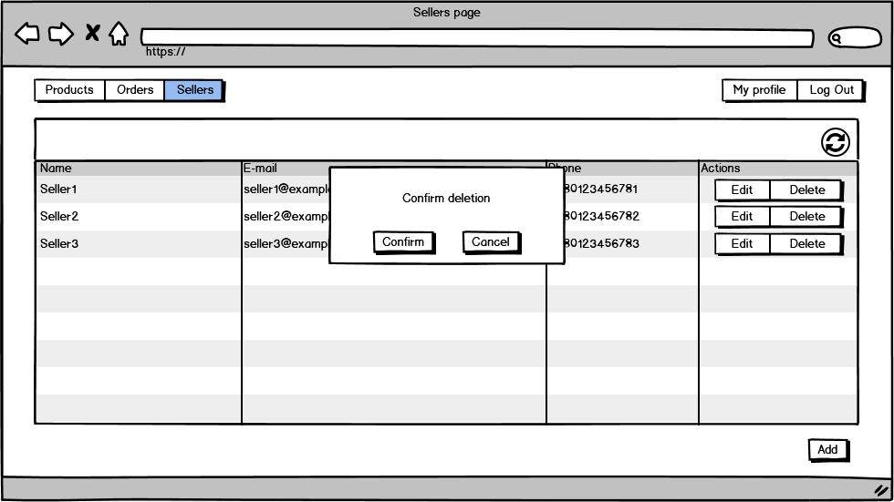

# E-commerce Platform

### Vision

The E-commerce Platform is a web application that provides sellers with tools to manage their products, orders, and customers

### Application should provide:

- Allow sellers to create and manage their accounts, including their business information, product listings, and order history.
- Display a list of products, including the product descriptions, inventory and prices.
- Display a list of orders, including the order details, customer information, and payment status.
- Search for products by keywords, categories, and filters, such as price range, color, and size.
- Allow sellers to add, edit, and remove products from their listings, including the product descriptions, inventory and prices.
- Allow sellers to view and manage their orders, including the order details, shipping information, and payment status.
- Allow the platform owner to manage the platform, including viewing, creating, modifying or deleting any data on the platform.

1. ## Authorisation

### 1.1 Login

#### Main scenario:
- User enters valid login data
- User is authorised to use the app
- If User is marked as administrator he has access to additional administrative functions

#### Invalid login data scenario:
- User enters valid login data
- User is asked to try again

Pic 1.1 Login page

### 1.2 Logout

#### Main scenario:
- User clicks "Log Out" button
- User is logged out and needs to log in again to use the app, Login page is displayed 

2. ## Sellers

The mode is designed to view or edit seller's personal data. If user has admin privileges he can 

### 2.1 Display Seller profile

#### Main scenario:
- User clicks "My Profile" button
- Page with user data opens

Pic 2.1 Profile page

Page displays the following data:
- Name - seller's name
- E-mail - sellers E-mail
- Phone - sellers phone number

### 2.2 Edit Seller data

#### Main scenario:
- User clicks "Edit" button on the profile page
- Application displays form to enter new data
- User enters profile data and presses “Save” button
- If any data is entered incorrectly, incorrect data messages are displayed
- If entered data is valid, then record is updated
- If error occurs, then error message is displaying
- If new data is successfully updated, then profile page is displayed

#### Cancel operation scenario:
- User clicks "Edit" button on the profile page
- Application displays form to enter new data
- User presses "Cancel" button or selects the menu item "Products" or "Orders"
- No data is saved, then profile page is displayed
- If user selected item from menu the corresponding page is displayed

Pic 2.2 Edit profile page

When editing a profile, the following details are entered:
- Name - seller's name
- E-mail - sellers E-mail
- Phone - sellers phone number

Constraints for data validation:
- Name - maximum length of 30 characters, not empty
- E-mail - a valid E-mail
- Phone - a valid international mobile phone number

3. ## Products

### 3.1 Display list of products

The mode is designed to view the list of products

Main scenario:
- User selects item "Products"
- Application displays list of products

Pic 3.1 Products page

The list displays the following columns:
- Name - product name
- Description - product description
- Price - price for 1 unit of a product
- Inventory - number of product units available
- Ordered - number of product units ordered
    
#### Filtering by inventory:
- In the products list view move, the user sets an inventory number filter and presses the refresh list button
- The application will display a products list view with filtered entries 

#### Filtering by ordered:
- In the products list view move, the user sets an ordered number filter and presses the refresh list button
- The application will display a products list view with filtered entries

### 3.2 Add product

#### Main scenario:
- User clicks the “Add” button in the products list view mode
- Application displays form to enter product data
- User enters product data and presses “Save” button
- If any data is entered incorrectly, incorrect data messages are displayed
- If entered data is valid, then record is added to database
- If error occurs, then error message is displaying
- If new product record is successfully added, then list of products with added record is displaying

#### Cancel operation scenario:
- User clicks the “Add” button in the products list view mode
- Application displays form to enter product data
- User presses "Cancel" button or selects the menu item "Products" or "Orders"
- No data is saved, then products list view is displayed
- If user selected item from menu the corresponding page is displayed

Pic 3.2 Add product page

When adding a product, the following details are entered:
- Name - product name
- Description - product description
- Price - price for 1 unit of a product
- Inventory - number of product units available

Constraints for data validation:
- Name - maximum length of 30 characters, not empty
- Description - maximum length of 300 characters, not empty
- Price - number greater than 0
- Inventory - non-negative integer

### 3.3 Edit product

#### Main scenario:
- User clicks "Edit" button near the product they want to edit
- Application displays form to enter new data
- User enters product data and presses “Save” button
- If any data is entered incorrectly, incorrect data messages are displayed
- If entered data is valid, then record is updated
- If error occurs, then error message is displaying
- If product is successfully updated, then list of products with updated data is displaying

#### Cancel operation scenario:
- User clicks "Edit" button near the product they want to edit
- Application displays form to enter new data
- User presses "Cancel" button or selects the menu item "Products" or "Orders"
- No data is saved, then product list view is displayed
- If user selected item from menu the corresponding page is displayed

Pic 3.3 Edit product page

When editing a product, the following details are entered:
- Name - product name
- Description - product description
- Price - price for 1 unit of a product
- Inventory - number of product units available

Constraints for data validation:
- Name - maximum length of 30 characters, not empty
- E-mail - maximum length of 300 characters, not empty
- Price - number greater than 0
- Inventory - non-negative integer

### 3.4 Delete product

#### Main scenario:
- User clicks "Delete" button near the product they want to remove
- Application displays confirmation dialog
- User confirms the removal of a product
- Record is deleted from the database
- If error occurs, then error message is displaying
- If product is successfully removed, then list of products with updated information is displaying

#### Cancel operation scenario:
- User clicks "Delete" button near the product they want to remove
- Application displays confirmation dialog
- User cancels the removal of a product
- Products list view is displayed

Pic 3.4 Delete product page

4. ## Orders

### 4.1 Display list of orders

The mode is designed to view the list of orders

Main scenario:
- User selects item "Orders"
- Application displays list of orders

Pic 4.1 Orders page

The list displays the following columns:
- Order ID - unique order ID
- Product - name of an ordered product
- Quantity - quantity of product units ordered
- Total cost - total cost of an order
- Date - creation date of an order
- Customer - information about customer
- Status - status of an order
    
#### Filtering by status:
- In the products list view move, the user selects status from the dropdown menu and presses the refresh list button
- The application will display an orders list view with filtered entries 

### 4.2 Add order

#### Main scenario:
- User clicks the “Add” button in the orders list view mode
- Application displays form to enter order data
- User enters order data and presses “Save” button
- If any data is entered incorrectly, incorrect data messages are displayed
- If entered data is valid, then record is added to database
- If error occurs, then error message is displaying
- If new order record is successfully added, then list of orders with added record is displaying

#### Cancel operation scenario:
- User clicks the “Add” button in the orders list view mode
- Application displays form to enter order data
- User presses "Cancel" button or selects the menu item "Products" or "Orders"
- No data is saved, then orders list view is displayed
- If user selected item from menu the corresponding page is displayed

Pic 4.2 Add order page

When adding an order, the following details are entered:
- Product - name of an ordered product
- Quantity - quantity of product units ordered
- Customer - information about customer
- Status - status of an order

Constraints for data validation:
- Product - name of an existing product, not empty
- Quantity - non-negative integer
- Customer - maximum length of 300 characters, not empty
- Status - existing status, not empty

### 4.3 Edit order

#### Main scenario:
- User clicks "Edit" button near the order they want to edit
- Application displays form to enter new data
- User enters order data and presses “Save” button
- If any data is entered incorrectly, incorrect data messages are displayed
- If entered data is valid, then record is updated
- If error occurs, then error message is displaying
- If product is successfully updated, then list of orders with updated data is displaying

#### Cancel operation scenario:
- User clicks "Edit" button near the product they want to edit
- Application displays form to enter new data
- User presses "Cancel" button or selects the menu item "Products" or "Orders"
- No data is saved, then product list view is displayed
- If user selected item from menu the corresponding page is displayed

Pic 4.3 Edit order page

When editing an order, the following details are entered:
- Product - name of an ordered product
- Quantity - quantity of product units ordered
- Customer - information about customer
- Status - status of an order

Constraints for data validation:
- Product - name of an existing product, not empty
- Quantity - non-negative integer
- Customer - maximum length of 300 characters, not empty
- Status - existing status, not empty

### 3.4 Delete order

#### Main scenario:
- User clicks "Delete" button near the order they want to remove
- Application displays confirmation dialog
- User confirms the removal of an order
- Record is deleted from the database
- If error occurs, then error message is displaying
- If order is successfully removed, then list of orders with updated information is displaying

#### Cancel operation scenario:
- User clicks "Delete" button near the order they want to remove
- Application displays confirmation dialog
- User cancels the removal of an order
- Orders list view is displayed

Pic 4.4 Delete order page

5. ## Administrator functions

Users, that are labeled as administrators have access not only to products and orders created by them, but to all products and orders on the platform, as well as to the list of all sellers and have the ability to add, edit and delete sellers

### 5.1 Display list of sellers

Main scenario:
- Administrator selects item "Sellers"
- Application displays list of sellers

Pic 5.1 Sellers page

### 4.2 Add seller

#### Main scenario:
- Administrator clicks the “Add” button in the sellers list view mode
- Application displays form to enter seller data
- Administrator enters seller data and presses “Save” button
- If any data is entered incorrectly, incorrect data messages are displayed
- If entered data is valid, then record is added to database
- If error occurs, then error message is displaying
- If new seller record is successfully added, then list of sellers with added record is displaying

#### Cancel operation scenario:
- Administrator clicks the “Add” button in the sellers list view mode
- Application displays form to enter seller data
- Administrator presses "Cancel" button or selects the menu item "Products", "Orders" or "Sellers"
- No data is saved, then sellers list view is displayed
- If administrator selected item from menu the corresponding page is displayed

Pic 5.2 Add seller page

When adding a seller, the following details are entered:
- Name - seller's name
- E-mail - sellers E-mail
- Phone - sellers phone number
- Password - sellers login password

Constraints for data validation:
- Name - maximum length of 30 characters, not empty
- E-mail - a valid E-mail
- Phone - a valid international mobile phone number
- Password - minimal length of 8 characters, maximum length of 30 characters, can contain only english letters, numbers and underscore symbols  

### 5.3 Edit seller

#### Main scenario:
- Administrator clicks "Edit" button near the seller they want to edit
- Application displays form to enter new data
- Administrator enters seller data and presses “Save” button
- If any data is entered incorrectly, incorrect data messages are displayed
- If entered data is valid, then record is updated
- If error occurs, then error message is displaying
- If product is successfully updated, then list of sellers with updated data is displaying

#### Cancel operation scenario:

- Administrator clicks "Edit" button near the seller they want to edit
- Application displays form to enter new data
- Administrator presses "Cancel" button or selects the menu item "Products", "Orders" or "Sellers"
- No data is saved, then sellers list view is displayed
- If administrator selected item from menu the corresponding page is displayed

Pic 5.3 Edit order page

When editing a seller, the following details are entered:
- Name - seller's name
- E-mail - sellers E-mail
- Phone - sellers phone number
- Password - sellers login password

Constraints for data validation:
- Name - maximum length of 30 characters, not empty
- E-mail - a valid E-mail
- Phone - a valid international mobile phone number
- Password - minimal length of 8 characters, maximum length of 30 characters, can contain only english letters, numbers and underscore symbols  

### 5.4 Delete seller

#### Main scenario:
- Administrator clicks "Delete" button near the seller they want to remove
- Application displays confirmation dialog
- Administrator confirms the removal of a seller
- Record is deleted from the database
- If error occurs, then error message is displaying
- If seller is successfully removed, then list of sellers with updated information is displaying

#### Cancel operation scenario:
- Administrator clicks "Delete" button near the seller they want to remove
- Application displays confirmation dialog
- Administrator cancels the removal of a seller
- Sellers list view is displayed

Pic 5.4 Delete seller page